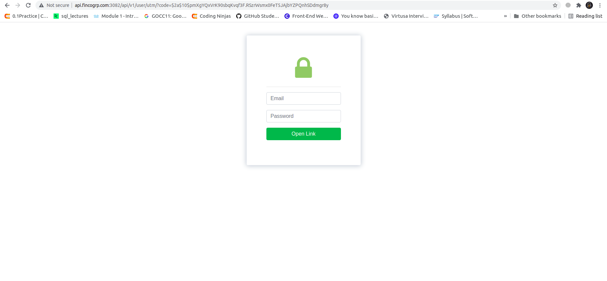
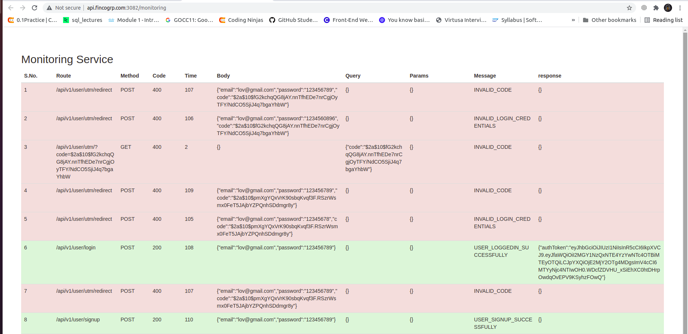

# URL Hashing System

I used MVC pattern in my system, i find out that approch more useful here. The reason is this approach is reusable & extendable also.

- Clone Repo into your Local System.
- npm i to install all required node_modules
- npm run dev to run the Api's.

Swagger_Link : http://api.fincogrp.com:3082/documentation/#/

  

# UnderStanding of System & Swagger.

  1). Admin
    <li>POST: To Add user Account</li>
    <li>POST: API of Login</li>
    <li>POST: Api for URL Shortner</li>
    <li>GET: To get all shorten URL List with details who that gmail via tht link is accessed</li>
  
 
 * http://api.fincogrp.com:3082/api/v1/user/utm/?code=
 
 add your short url here to get access, & paste that short url here afetr '=' sign & run this complete url in your chrome.
 That URl will redirect you to the login page.
 
 Follow point 2 of User to get access to that short link.
 
 
    
  2). User
    <li>POST: To Register User who wants to access that short url</li>
    <li>POST: To Login that user who resitered for accesing that short Url.</li>
    
  

      
  

  
  Monitring Link: http://api.fincogrp.com:3082/monitoring
  To check who visited the short link, with all details.
  

      
  

