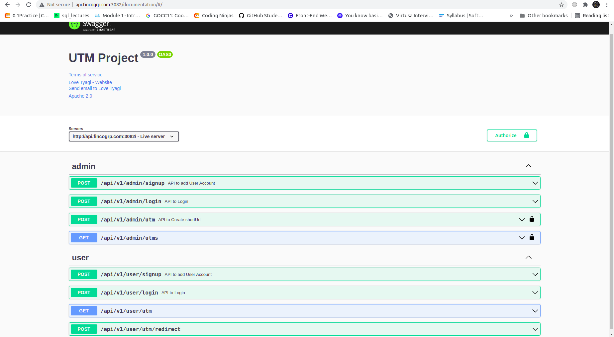

# URL Hashing System

I used MVC pattern in my system, I find out that approach more useful here, the reason of this approach is reusability & extendability.

In this System via admin swagger you can create short-url & all short-url listing and to access that short url user have to login via gmail & after that follow 2nd point & put you credientials to that login page & it will redirect you to the actual page with the help of Short_Url.
To check who visited that link you can use monitoring link mentioned in last.

- Clone Repo into your Local System.
- <b>npm i</b> to install all required node_modules
- <b>npm run dev</b> to run the Api's.

<b>Swagger_Link</b> : http://api.fincogrp.com:3082/documentation/#/

  

# UnderStanding of System & Swagger.

  1). Admin
    <li>POST: To Add user Account</li>
    <li>POST: API of Login</li>
    <li>POST: Api for URL Shortner</li>
    <li>GET: To get all shorten URL List with details like gmail via that link is accessed</li> 
 
    
  2). User
    <li>POST: To Register User who wants to access that short url</li>
    <li>POST: To Login that user who did registration for accesing that short Url.</li>
    <li><b>http://api.fincogrp.com:3082/api/v1/user/utm/?code= </b></li>
 
   add your short url here to get access, & paste that short url afetr '=' sign & run this complete url in your chrome.
   That URl will redirect you to the login page.  
 
   Follow point 2 of User to get access to that short link.(To cross that login Page)
    
  

      
  

  
  <b>Monitring Link:</b> http://api.fincogrp.com:3082/monitoring
  To check who visited the short link, with all details.
  

      
  

